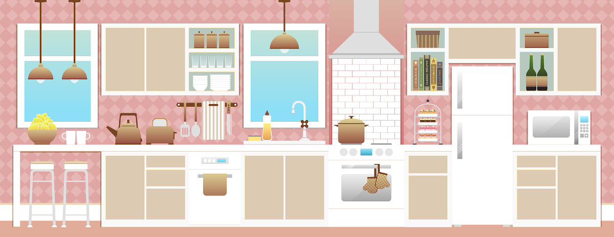

Title: Vida en Armonía
Slug: vida-en-armonia
Summary: Una vez que hemos implementado el sistema de organización personalizado, deberemos establecer nuevas rutinas; ellas nos ayudarán a la creación de hábitos que mantengan el orden de manera automática, brindándole un corazón a la estructura que nos aleje del desorden y nos permita alcanzar la armonía en nuestros espacios.
Tags: vida, armonia
Date: 2019-06-16 18:00
Modified: 2019-06-16 18:00
Author: Rosy
Category: articulos
Preview: preview.jpg
Image: kitchen.jpg

### Organización y orden

Antes de abordar el tema de la organización de espacios tenemos que empezar por diferenciar entre dos conceptos que nos son de particular relevancia: organización y orden.

La organización es un sistema que nos permite alcanzar ciertas metas y objetivos. Está relacionada con la gestión del tiempo y el conjunto de tareas que nos llevarán a lograr nuestros propósitos.

En nuestro caso particular, consideraremos el orden como la manera en la que están distribuidos los objetos en algún lugar y tiempo determinados ya que de esto depende que nuestro espacio sea funcional.

La organización y el orden necesariamente tienen que ir de la mano si queremos ser eficientes, sin embargo esta capacidad no es algo que se presente de manera natural en todas las personas; a la mayoría se nos enseña a mantener el orden con un sistema de organización tradicional que no a todos nos da el resultado deseado porque es el sistema el que se debe que adaptar a cada persona de acuerdo a sus necesidades y estilo de vida.

Por esta razón es que solemos tener problemas para asignar espacios a los objetos o para respetarles su lugar una vez asignado. De esta manera perdemos tiempo buscando cosas de uso cotidiano que extraviamos continuamente, por la falta de un sistema de organización adecuado.

Encontrar un sistema de organización apropiado, nos ayudará a hacer del orden algo permanente; permitiendo enfocar nuestro esfuerzo en llevar a cabo nuestros planes, evitándonos lidiar con el desorden y haciéndonos más productivos.

Todos merecemos habitar un espacio armónico, libre de caos, que nos permita aprovechar el tiempo; para que al final del día nuestro hogar sea lugar confortable y tranquilo, donde estemos rodeados de aquellas cosas que nos gustan.

### Nuevas rutinas

Una vez que hemos implementado el sistema de organización personalizado, deberemos establecer nuevas rutinas; ellas nos ayudarán a la creación de hábitos que mantengan el orden de manera automática, brindándole un corazón a la estructura que nos aleje del desorden y nos permita alcanzar la armonía en nuestros espacios.

### Cuál es tu estilo

¿Cuántas veces nos hemos visto en medio de un espacio invadido por el caos, determinados a poner orden, y no sabemos por dónde empezar? Seguramente más de una vez nos hemos visto en esta situación y el resultado sigue siendo el mismo. Iniciamos moviendo cosas de un lado a otro, tratando de controlar el desorden y terminamos fatigados, abrumados y frustrados porque el caos sigue ahí, solamente lo cambiamos de lugar. Para restablecer la armonía en nuestro espacio debemos conocer cuál sistema es el adecuado para nosotros, de acuerdo a nuestra personalidad y estilo de ordenar. Un profesional de la organización te ayudará a conocer cuál es tu estilo y el primer paso es realizar nuestro test gratuito.

### Comienza tu vida en armonía

Has dado el primer paso para poder empezar a diseñar el sistema que traerá orden a tus espacios. Estamos capacitados para ayudarte a depurar los objetos que ya no necesitas o que no traen felicidad a tu vida. A través de estas herramientas que brindaremos especialmente para ti, podremos integrar funcionalidad y estética.

No esperes más y agenda tu cita.
